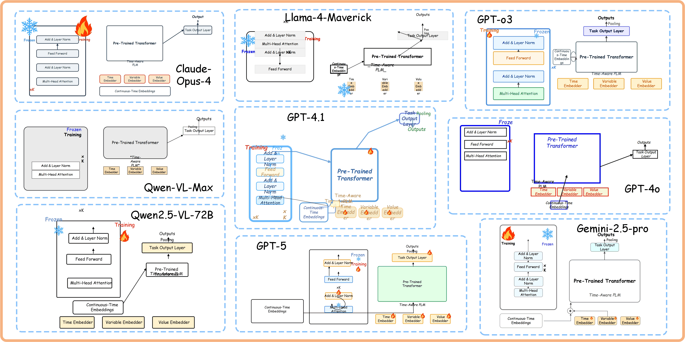
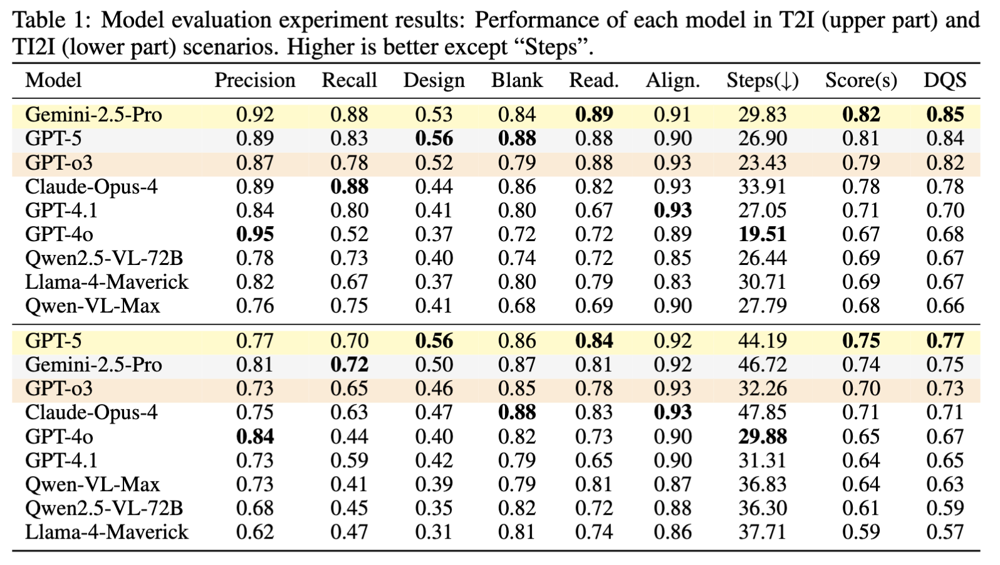

# From Pixels to Paths: A Multi-Agent Framework for Editable Scientific Illustration


 ## 💡 Open Source Progress 
- Our current benchmark and evaluation scripts are officially released 🎉.
- The evaluation set data and evaluation work are continuously being updated 💪.
- The Chinese version of the VisPainter framework has completed the sorting of all MCPsever tools! It will be released soon~ 🔥.
- The English version of the VisPainter framework is being sorted out at an accelerated pace, so stay tuned~ ⏱️.


## 🚀  VisPainter framework diagram and workflow diagram


The overall workflow proceeds as follows:  
(1) the Manager parses the user request into a structured task and locates the relevant Visio functions;  
(2) the Designer generates an initial draft layout;  
(3) the Manager invokes Toolbox operations to render the draft and captures a screenshot;  
(4) the Designer iteratively updates the layout based on feedback until convergence.  
The final output includes both a bitmap preview for quick inspection and a vector source file that can be further modified within Visio or other editors.

## ✏️ Platform and Usage

The VisPainter framework runs on the cline v3.17.14 platform：

Operating environment：
   ```
   pip install -r requirements.txt
   ```

Configuration Method of MCPserver Tool：

example_1:

   ```bash
    "VLM-mcp-server": 
    {
      "autoApprove": [
        "restart_server",
        "ask_with_images",
        "design_scientific_figure"
      ],
      "disabled": false,
      "timeout": 60,
      "type": "stdio",
      "command": "cmd",
      "args": [
        "/c",
        "call ..\\Scripts\\activate.bat ..\\envs\\mcp && python ..\\vlm-answer.py"
      ]
    },
   ```


## 🔍 Evaluation

1. **Add model API**
   ```
   cd Evaluation
   Add the correct API to the evaluation code: evaluation_code.py。
   ```

2. **Result Preparation**
   ```
   Place the PDF of the scientific drawing to be evaluated in the result_pdfs folder according to the correct naming format.。
   ```

3. **Run evaluation**
   ```
   python evaluation_code.py
   ```

## 📊 Model drawing examples and evaluation results




## 💥 Acknowledgement
We would like to thank the open-source framework cline and SII for providing API support for this work.

## ⛓️‍💥 Citation

```
@misc{sun2025pixelspathsmultiagentframework,
      title={From Pixels to Paths: A Multi-Agent Framework for Editable Scientific Illustration}, 
      author={Jianwen Sun and Fanrui Zhang and Yukang Feng and Chuanhao Li and Zizhen Li and Jiaxin Ai and Yifan Chang and Yu Dai and Kaipeng Zhang},
      year={2025},
      eprint={2510.27452},
      archivePrefix={arXiv},
      primaryClass={cs.CV},
      url={https://arxiv.org/abs/2510.27452}, 
}
```
